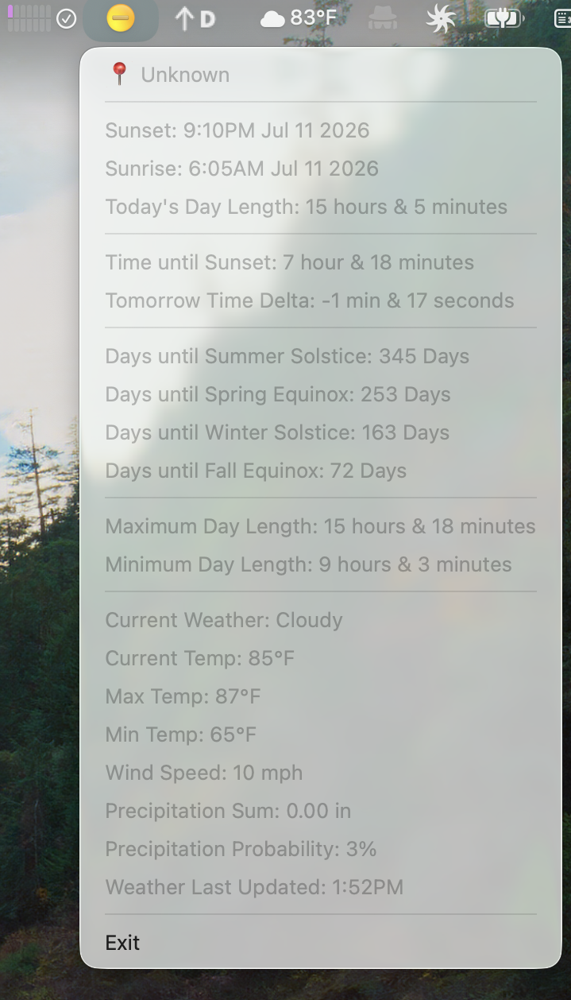

# SunTray

A macOS system tray application that displays sunrise/sunset times, seasonal countdowns, and current weather conditions.

Icons from: <a href="https://www.flaticon.com/free-icons/drop" title="drop icons">Drop icons created by Pixel perfect - Flaticon</a>


## Requirements

- Java 21+
- [Gradle](https://gradle.org/) (or use the wrapper once generated)

## Configuration

SunTray is configured via environment variables:

| Variable | Required | Default | Description |
|---|---|---|---|
| `SUNTRAY_LATITUDE` | No | `42.5869` | Location latitude |
| `SUNTRAY_LONGITUDE` | No | `-82.9200` | Location longitude |
| `SUNTRAY_WEATHER_CITY` | No | `berkley` | City name for weather API |

## Building

```bash
# Compile and build the fat JAR
./gradlew build

# Run directly
./gradlew run

# Create native macOS .app bundle
./gradlew jpackage
```

## Features

- ☀️ Sunrise and sunset times for configured location
- ⏱ Time remaining until sunset (or since sunset)
- 📊 Tomorrow's daylight delta compared to today
- 📅 Days until each solstice and equinox
- 📏 Maximum (summer) and minimum (winter) day lengths
- 🌡 Current temperature, high/low, and wind speed
- 🌙 Dynamic tray icon: sun, moon, rain, or snow based on conditions
